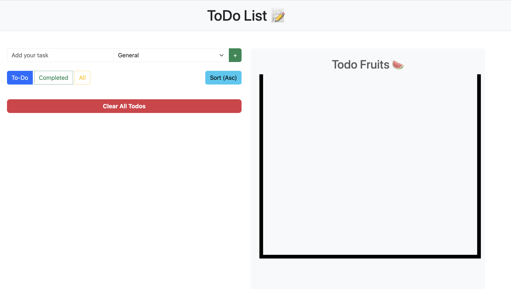

# FruitTodo App 🍉

FruitTodo is a visually engaging and interactive to-do list app built with Vue 3. It combines task management with a fun fruit-themed visualization using the Matter.js physics engine. Tasks are represented as fruits that fall into a basket, and their size and color vary based on importance. The app is designed to enhance productivity while keeping it fun and lighthearted.

---

## Features ✨

### Task Management
- **Add Tasks**: Easily add tasks with an importance level.
- **Edit Tasks**: Update task text or importance.
- **Mark as Completed**: Toggle tasks between completed and to-do states.
- **Filter Tasks**: View tasks by their status (`to-do`, `completed`, or `all`).
- **Sort Tasks**: Sort tasks by importance (`ascending` or `descending`).
- **Clear Tasks**: Delete all uncompleted tasks at once.

### Visualization
- **Fruit Representation**: Tasks are visualized as fruits in a basket. 
  - Task importance determines the fruit's size and color.
  - Fruits move dynamically within the basket using gravity and collision physics.
- **Threshold Warning**: Blocks adding new tasks if the total fruit area exceeds 60% of the basket.

### Persistent Storage
- Tasks are stored locally using Pinia's persisted state feature.

---

## Project Structure 🐂

```plaintext
├── public/
│   ├── favicon.ico
├── src/
│   ├── assets/
│   │   ├── global.css  # Global styles
│   ├── components/
│   │   ├── Fruit.vue       # Fruit visualization using Matter.js
│   │   ├── TodoInput.vue   # Input field for adding tasks
│   │   ├── TodoItem.vue    # Component for individual tasks
│   ├── constants/
│   │   ├── fruits.js       # Fruit properties by importance
│   ├── router/
│   │   ├── index.js        # Router setup for navigation
│   ├── stores/
│   │   ├── todoStore.js    # Pinia store for managing tasks
│   ├── views/
│   │   ├── TodoListView.vue  # Main task management page
│   ├── App.vue             # Root component
│   ├── main.js             # App entry point
├── index.html              # HTML template
├── vite.config.js          # Vite configuration
```

---

## Demo & Screenshots 📸

### Demo
### [](https://youtu.be/ez9XW-NKxOY)

<div style="position: relative; padding-bottom: 56.25%; height: 0; overflow: hidden; max-width: 100%; height: auto;">
  <iframe style="position: absolute; top: 0; left: 0; width: 100%; height: 100%;" src="https://www.youtube.com/embed/ez9XW-NKxOY" frameborder="0" allow="accelerometer; autoplay; clipboard-write; encrypted-media; gyroscope; picture-in-picture" allowfullscreen></iframe>
</div>

 
 


---

## Installation 🚧

### Prerequisites
- Node.js (v16 or later)
- npm or yarn

### Steps
1. Clone the repository:
   ```bash
   git clone https://github.com/your-username/fruit-todo-app.git
   cd fruit-todo-app
   ```

2. Install dependencies:
   ```bash
   npm install
   ```

3. Start the development server:
   ```bash
   npm run dev
   ```

4. Open the app in your browser at:
   ```
   http://localhost:5173
   ```

---

## Technologies Used 🧭

- **Frontend**: Vue 3 (Composition API, `<script setup>`), Pinia
- **Styling**: Bootstrap 5, Scoped CSS
- **Physics Engine**: Matter.js
- **Build Tool**: Vite

---

## Improvements & Roadmap 🚀

### Refactoring
- Modularize the `Fruit.vue` and `TodoListView.vue` components to improve maintainability and readability.
- Move Matter.js-specific logic from `Fruit.vue` to a composable function or utility file.
- Optimize computed properties in `TodoListView.vue` for performance.

### Additional Features
- Add/edit/delete deadline for tasks
- Notification/push feature for overdue tasks
- Categorization of tasks
- Upgrade fruit visualization and simulation engine

---

## License 📝

This project is licensed under the [MIT License](./LICENSE).

---

## Contributing 🤝

Contributions are welcome! Feel free to open issues or submit pull requests.

1. Fork the project.
2. Create your feature branch: `git checkout -b feature/new-feature`.
3. Commit your changes: `git commit -m 'Add a new feature'`.
4. Push to the branch: `git push origin feature/new-feature`.
5. Open a pull request.

---

Enjoy your journey to productivity with a fruity twist! 🍎🍊🍇